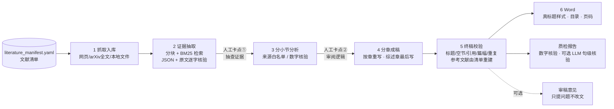

# Scientific_Report_Workflow

> 给它一份**文献清单**，得到一篇**每个论断都能追溯到原文**的技术调研报告（Markdown + Word）。

大模型写调研报告最大的风险不是文笔，而是**编造**：编出不存在的数据、把 A 文献的结论安到 B 文献头上。
本项目把写作拆成六个阶段，让模型在每一步都只做一件事，并用**代码**（而不是“请不要编造”的提示词）去核验它的输出：

- 阶段 2 每条证据必须带**逐字原文摘录**，代码校验摘录确实出自该来源，数字也确实出现在原文里；
- 阶段 3/4 引用编号只能来自本小节/本章的证据，非法编号被**确定性删除**；
- 参考文献只由文献清单生成，模型不参与；
- 质检阶段再对终稿做一次数字核验，列出“值得人工复核”的句子。



## 5 分钟上手

```bash
git clone git@github.com:Andreawwwbnu/Scientific_Report_Workflow.git
cd Scientific_Report_Workflow
python -m venv .venv && source .venv/bin/activate
pip install -e .            # 或 pip install -r requirements.txt

# ① 不联网、不要 API Key：用虚构素材 + MockLLM 跑通整条流水线，看看每个阶段产出什么
report-wf run demo --mock
# 产物在 projects/demo/output/，样例见 examples/demo_output/

# ② 接真实模型：复制 .env.example 为 .env，填入 DEEPSEEK_API_KEY（任何 OpenAI 兼容端点都行）
cp .env.example .env
report-wf validate low_precision        # 先校验配置与文献清单（不联网、不花钱）
report-wf run low_precision --stages 1  # 抓取；失败的条目会生成占位文件并列出清单，手工粘贴正文即可
report-wf run low_precision --stages 2-4
report-wf run low_precision --stages 5-7
```

> `--mock` 的输出只复述输入素材，**用于验证流程，不是真实报告**。

## 命令一览

| 命令 | 作用 |
|---|---|
| `report-wf validate <项目>` | 校验配置与文献清单：编号重复、章节不存在、alias 指向缺失、`et al.`、`extract_rule` 里点名了不存在的编号…… |
| `report-wf run <项目> [--stages …]` | 运行流水线。`--stages all`（默认）\| `2-4` \| `fetch,structure,…` |
| `report-wf status <项目>` | 各阶段产物是否齐全 |
| `report-wf init <名称>` | 从 `projects/_template` 创建新专题 |

常用选项：`--only-chapter 02,03`（只重跑指定章）、`--force`（阶段 1 强制重抓）、`--no-cache`、`--no-gate`（阶段未通过也继续）、`--llm-check`（质检阶段启用 LLM 句级核验）、`--root`（覆盖输出目录）、`--mock`。

`<项目>` 可以是 `projects/` 下的目录名，也可以是任意目录路径。阶段未通过质量门禁时流水线**停止并返回非零退出码**，避免错误一路流入终稿。

## 仓库结构

```
├── report_workflow/            核心代码（每个阶段一个模块）
│   ├── prompts/                6 个 Prompt 模板（带版本号，可被专题目录覆盖）
│   ├── s1_fetch.py … s6_to_word.py, s7_qc.py
│   ├── corpus.py               分块 + BM25 检索    ├── evidence.py   证据/分析文件格式
│   ├── llm.py                  客户端/缓存/Mock    └── config.py     配置、校验、篇幅预算
├── projects/
│   ├── _template/              带逐项注释的新专题模板
│   ├── demo/                   离线演示专题（虚构素材）
│   ├── low_precision/          大模型低精度计算
│   └── frontier_risk/          前沿模型风险评估
├── examples/                   示例产物（demo_output：v3 格式；ai_native_database：旧版产物，仅供参考）
├── docs/ARCHITECTURE.md        数据契约、质量门禁、扩展点
├── docs/history/AUDIT.md       v2 之前的审计记录（存档）
└── tests/                      离线测试（pytest）
```

## 新建一个专题

```bash
report-wf init my_topic          # 复制模板到 projects/my_topic/
```

只需要改两个文件（模板里每个字段都有注释）：

- **`literature_manifest.yaml`**：文献清单——编号、标题、URL、归属章/小节。需要时用 `alias_for` 声明镜像文献、`related_urls` 拼接同一成果的多个入口、`local_file` 指向本地正文。
- **`project.yaml`**：
  - `chapters`：取材章与小节，每个小节写 `extract_rule`（抽什么）与 `analyze_task`（怎么分析）；
  - `report.chapters`：成稿结构，可以把多个取材章压缩成更少的节；每章有 `weight`（篇幅权重）、`write_guide`（写作要点）、`no_subheadings`、`synthesis`（综述章最后写）；
  - `word_count`：目标篇幅，各章字数由它按权重自动推导；
  - `draft.style_rules`：专题级写作要求。

换专题**不需要改任何 Python 代码**。Prompt 想自定义：在专题目录下建 `prompts/extract.md` 等同名文件即可覆盖默认版本。

## 各阶段产物与你要做的事

| 阶段 | 产物（`output/` 下） | 你需要做的 |
|---|---|---|
| 1 抓取 | `02-原始素材/<章>/<编号> - 标题.md`（YAML 元数据 + 正文） | 失败条目（占位文件）手工粘贴正文。**重跑不会覆盖你补充过的文件** |
| 2 证据 | `03-结构化素材/` 每条证据带原文摘录与分块编号 | **卡点①**：抽查定义、数字、归属；可直接增删要点 |
| 3 分析 | `04-分析产出/` 分小节论证，无证据的小节被标记并跳过 | **卡点②**：审阅逻辑与来源标注 |
| 4 草稿 | `05-报告草稿/chapters/*.md`（分章）+ 合并稿 + `draft_report.json` | 审阅事实、逻辑；某章不满意只重跑该章：`--stages 4 --only-chapter 02` |
| 5 终稿 | `06-终稿与参考文献/*.md` | 看控制台的错误/警告 |
| 6 Word | `06-终稿与参考文献/*.docx` | 若开启目录：打开后右键 → 更新域 |
| 质检 | `质检报告.md` | 逐条复核被标出的句子 |
| 审稿（可选） | `审稿意见.md` | 自行判断是否采纳 |

`output/.workflow/` 里是 LLM 缓存和每次运行的记录（模型、各阶段耗时/结果、token 用量）。

## 质量保证：到底检查了什么

| 环节 | 检查 | 失败时 |
|---|---|---|
| 2 证据 | 来源在白名单内；`quote` 是所给原文块的**逐字子串**；`claim` 中的数字出现在原文中；去重 | 丢弃该条；比例过高则带反馈重试一次；整章无证据则门禁失败 |
| 3 分析 | 引用 ⊆ 本小节证据来源；数字出自证据；长度范围 | 带反馈重试一次；仍有非法引用则**删除该要点**；其余记录为警告 |
| 4 成稿 | 标题与蓝图逐行一致；引用 ⊆ 允许名单；篇幅在章预算内；段落不过长 | 只重写该章（最多 `max_rewrites` 次）；非法引用自动剔除；标题仍不符则门禁失败 |
| 5 终稿 | 标题齐全、无空节、编号都在清单内、篇幅口径、近重复句 | 有错误则门禁失败（仍写出终稿便于排查） |
| 质检 | 带引用句里的数字必须出现在所引来源**全文**；含数字但无引用的句子；引用分布 | 输出线索清单，由你复核 |

## 成本与耗时

模型调用次数大致是：阶段 2 = 小节数，阶段 3 = 小节数，阶段 4 = 章数 + 1（摘要/结论）；质检的 LLM 核验与审稿默认关闭。
例如 `low_precision`（11 个小节、4 章）最少约 27 次调用；核验不通过触发的重试会增加次数。
相同输入第二次运行直接命中缓存，不重复计费，所以“改一个小节再重跑”只会为受影响的 Prompt 付费。
阶段 2/3/4 默认 3 路并发（`llm.concurrency`）。

## 局限与声明

- **LLM 产出必须人工核验。** 本项目降低编造风险、把需要复核的地方标出来，不能保证零错误。
- 数字核验是字面比对：中文数字、单位换算（“7 万”↔ 70,000）、跨句推算可能误报或漏报。
- 逐字原文校验保证“摘录真实存在”，不保证模型对摘录的**理解**正确——这是卡点①和质检要你把关的部分。
- 网页抓取受反爬、JS 渲染影响；arXiv PDF 回退需要 `pypdf`。抓不到的条目请手工补充正文。
- 检索使用 BM25（无向量库）。主题术语与原文用词差异很大时，可在 `extract_rule` 中点名关键词，或调大 `retrieval.top_k`。

## 开发

```bash
pip install -e ".[dev]"
ruff check .
pytest -q                        # 全部离线，不需要网络和 API Key
report-wf run demo --mock        # 端到端冒烟
```

## 从 v2 升级

配置从 `config/` 迁到 `projects/<名称>/`；`report_blueprint` 改为 `report.chapters`；`root` 默认 `./output`（相对专题目录）；
入口从 `python -m workflow.run_pipeline --config …` 改为 `report-wf run <项目>`。逐项变化见 [CHANGELOG.md](CHANGELOG.md)。

## License

MIT，见 [LICENSE](LICENSE)。
