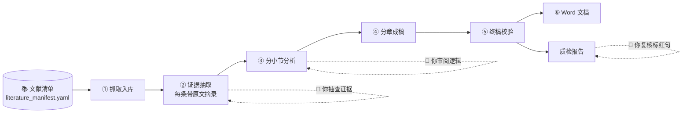

# Scientific_Report_Workflow

**把一份文献清单，加工成一篇关键论断可追溯到原文的技术调研报告（Markdown + Word）。**

大模型写调研报告，最大的风险不是文笔，而是**编造**：编出不存在的数据，或者把 A 文献的结论安到 B 文献头上。
本项目的思路是：不要让模型"一口气写完整篇"，而是拆成六个阶段，每个阶段只让它做一件事；并且用**代码**去核验它的输出，而不是只在提示词里写一句"请不要编造"。



---

## 这个项目适合谁？

| 你是…… | 你想…… | 建议从这里读起 |
|---|---|---|
| **情报 / 调研 / 战略分析人员** | 围绕一个技术主题，快速得到一份结构规范、引用可查的初稿 | [它能产出什么](#它能产出什么) → [一个专题是怎么跑完的](#一个专题是怎么跑完的) → [快速开始](#快速开始) |
| **研究生 / 科研人员** | 做某个方向的技术综述，并且需要知道每个结论的出处 | [一个专题是怎么跑完的](#一个专题是怎么跑完的) → [质量保证](#质量保证到底检查了什么) |
| **开发者 / 想二次开发的人** | 换模型、换检索方式、加数据源、改输出格式 | [给开发者](#给开发者) 与 [docs/ARCHITECTURE.md](docs/ARCHITECTURE.md) |
| **只是路过的访客** | 想知道这是什么、靠不靠谱 | 本页前两节 + [局限与声明](#局限与声明) |

**不太适合的场景：** 需要原创实验数据的论文、没有现成文献可依据的纯观点文章、对"零错误"有硬性要求且无人复核的场合。本项目产出的是**需要人工把关的高质量初稿**，不是免审成品。

---

## 它能产出什么

输入：你整理好的**文献清单**（标题、链接、归属哪一章哪一节），以及一份**专题配置**（报告结构、每节要抽取什么、目标篇幅）。

输出：

- 一篇结构固定的调研报告：摘要 → 关键词 → 若干章（含小节）→ 结论与展望 → 参考文献；
- 正文引用统一为上角标 `[n]`，对应文末参考文献（GB/T 7714 风格，含引用日期）；
- Word 文档带真正的标题样式（导航窗格可用）、页码，可选目录；
- 一份**质检报告**：哪些句子里的数字在所引来源里找不到、哪些句子带数字却没有引用、每个来源被引了几次；
- 全过程的中间产物（原始素材、证据、分析、分章草稿），每一份都是人能读、能改的 Markdown。

完整示例见 [`examples/demo_output/`](examples/demo_output/)（用虚构素材离线生成，仅用于展示各阶段产物的格式，**不是真实报告**）。

---

## 一个专题是怎么跑完的

下面用一条证据，从头到尾看它如何变成报告里的一句话。

### ① 抓取入库 —— 把清单变成可读的原始素材

清单里每一条文献包含：编号（如 `LBQ06`）、标题、URL、所属章节。程序按 URL 抓取：

- 普通网页 → 提取正文；
- arXiv → 优先抓**全文**（HTML 版，失败再回退 PDF），不是只抓摘要；
- 本地文件（`local_file`）→ 直接读取，不联网。

每篇文献存成一个 Markdown 文件，顶部是元数据（来源、发布主体、可信度等级……），下面是正文。

> 👤 **你要做的：** 抓取失败的条目（反爬、JS 渲染页面）会生成一个占位文件并在末尾列成清单。打开它，把正文粘贴进去即可。
> **重跑抓取不会覆盖你补充过的文件**；只有加 `--force` 才会强制重抓。

### ② 证据抽取 —— 只抽取，不写作

对报告的**每一个小节**，程序先把相关文献的全文切成小块，按"小节名 + 你写的抽取规则"做检索，把最相关的几块原文交给模型。
模型只许输出这样的结构：

```
- 一句话事实陈述。[LBQ06]
  > 原文：从来源里逐字摘录的那句话 ｜ LBQ06#c3
```

随后**代码**逐条核验，不合格的直接丢弃，不是"提醒一下"：

1. 来源编号必须在这个小节的允许名单里；
2. "原文"必须是所给文献片段里的**逐字子串**——编造的引文在这一步就被拦下；
3. 陈述里的数字必须真的出现在原文里。

> 👤 **你要做的（人工卡点①）：** 打开 `03-结构化素材/`，抽查定义、数字、条目是否放对了章节。因为每条都带原文摘录，核对一条只要几秒；不满意的条目直接删改，下游读取的就是这个文件。

### ③ 分小节分析 —— 只推理，不补料

模型拿到某个小节的证据，写出 3–5 条逻辑递进的分析要点，每条标注来源编号。规则同样由代码把关：

- 引用只能来自**本小节证据**里出现过的来源；
- 出现非法引用 → 带着具体问题让模型重写一次；仍有 → **直接删掉那一条**，不让错误往下游传；
- 分析里出现证据中没有的数字 → 同样重试，仍有则记为警告；
- 某小节没有证据 → 标记为"无充分证据"并跳过，后面成稿时不允许就它展开。

> 👤 **你要做的（人工卡点②）：** 看分析逻辑是否成立、来源标注是否对得上。

### ④ 分章成稿 —— 一章一章写，哪章不行重写哪章

- 每章单独生成，按"写作要点 + 本章分析 + 本章证据"写作；
- "遴选理由"这类归纳性章节**最后写**，并且能看到其他章已写的内容，避免重复；
- 每章写完立刻检查：标题与蓝图是否逐行一致、引用是否合法、字数是否在预算内、段落是否过长。**哪一章不过关，只重写那一章**，并把具体问题告诉模型；
- 摘要、关键词、结论在所有章节完成后单独生成，只能概括正文已有的内容；
- 各章字数预算不写死：由配置里的总篇幅和各章权重自动推导。

> 👤 某章你不满意，可以只重跑它：`report-wf run <项目> --stages 4 --only-chapter 02`

### ⑤ 终稿校验 —— 不调用模型，纯确定性处理

- 参考文献**一律由文献清单生成**，模型不参与（所以不会"漏写"或"写错"）；
- 校验标题完整、没有空节、所有引用编号都在清单内、篇幅口径、跨章近重复句；
- 有错误会停在这里并给出清单，而不是悄悄放行。

### ⑥ 输出 Word，以及质检报告

- Word：标题用真正的 Title / Heading 样式，正文引用映射为上标 `[n]`，参考文献悬挂缩进、链接可点击；
- 质检：对终稿再做一次数字核验——带引用句子里的数字必须出现在所引来源**全文**中；另外列出"含数字却没有引用"的句子。

> 👤 **你要做的：** 逐条复核质检报告里被标出的句子。这是**线索清单**，不是判决书。

### 可选：LLM 句级核验与审稿

- `--llm-check`：对带引用的句子，取其所引来源最相关的原文片段，让模型判断"被支持 / 部分支持 / 不支持"；
- `review` 阶段：让模型以审稿人身份**只提问题、不改文**，输出 `审稿意见.md`。

两者默认关闭（额外耗费）。

---

## 快速开始

```bash
git clone git@github.com:Andreawwwbnu/Scientific_Report_Workflow.git
cd Scientific_Report_Workflow
python -m venv .venv && source .venv/bin/activate
pip install -e .
```

### 第一步：不联网、不要密钥，先看看流程长什么样

```bash
report-wf run demo --mock
```

用虚构素材和离线的 MockLLM 跑完整条流水线，产物在 `projects/demo/output/`。
`--mock` 的输出只是机械复述输入，**用来验证流程，不是真实报告**。

### 第二步：接入真实模型，跑你自己的专题

```bash
cp .env.example .env        # 填入 DEEPSEEK_API_KEY（任何 OpenAI 兼容接口都可以）

report-wf validate low_precision          # 校验配置与文献清单：不联网、不花钱
report-wf run low_precision --stages 1    # 抓取；按提示手工补充失败条目
report-wf run low_precision --stages 2    # 证据抽取 → 去做人工卡点①
report-wf run low_precision --stages 3    # 分析     → 去做人工卡点②
report-wf run low_precision --stages 4-7  # 成稿、终稿、Word、质检
```

一次跑完也可以：`report-wf run low_precision`（默认 `--stages all`）。
阶段未通过质量门禁时，流水线会**停下并返回非零退出码**；修复后重跑即可。

### 常用命令

| 命令 | 作用 |
|---|---|
| `report-wf validate <项目>` | 检查配置：编号重复、章节不存在、`alias_for` 指向缺失、作者含 `et al.` 等 |
| `report-wf run <项目> --stages 2-4` | 运行指定阶段（`all` / `1-7` / `fetch,structure,…`） |
| `report-wf run <项目> --only-chapter 02,03` | 只处理指定章（用于阶段 2/3/4） |
| `report-wf run <项目> --force` | 阶段 1 强制重抓已有素材 |
| `report-wf run <项目> --llm-check` | 质检阶段启用 LLM 句级核验 |
| `report-wf status <项目>` | 查看各阶段产物是否齐全 |
| `report-wf init <名称>` | 从模板创建新专题 |

`<项目>` 可以是 `projects/` 下的目录名，也可以是任意目录路径。

---

## 做你自己的专题

```bash
report-wf init my_topic       # 复制模板到 projects/my_topic/
```

只需要编辑两个文件，模板里每个字段都有注释：

**`literature_manifest.yaml` —— 文献清单**
每条文献写编号、标题、URL、归属章和小节。还有几个实用字段：`alias_for`（同一篇文献的镜像条目，引用自动归并）、`related_urls`（同一成果的多个入口一起抓）、`local_file`（直接指向本地正文）。

**`project.yaml` —— 专题配置**

| 配置块 | 决定什么 |
|---|---|
| `chapters` | 取材结构：有哪些章、哪些小节；每小节写 `extract_rule`（抽什么、不抽什么）和 `analyze_task`（怎么分析） |
| `report.chapters` | 成稿结构：标题、`weight`（篇幅权重）、`write_guide`（本章写作要点）、是否设小节、是否最后写 |
| `word_count` | 目标篇幅；各章字数由它和权重自动推导 |
| `draft.style_rules` | 专题级写作要求（读者对象、语气、禁用词等） |
| `references` | 是否只列被引文献、编号顺序、作者截断规则 |
| `llm` | 各阶段用哪个模型、并发数、是否缓存 |

换专题**不需要改任何 Python 代码**。想定制提示词：在专题目录下新建 `prompts/extract.md` 等同名文件，即可覆盖默认版本。

**写好 `extract_rule` 的小窍门：** 说清"抽什么"，更要说清"不抽什么"（例如"不展开具体索引实现"）；规则里点名的文献编号，会被自动加入该小节的候选来源。

---

## 质量保证：到底检查了什么

| 环节 | 检查内容 | 不通过时 |
|---|---|---|
| ② 证据 | 来源在白名单内；原文摘录是所给片段的逐字子串；陈述中的数字出现在原文中；去重 | 丢弃该条；丢弃比例过高则带反馈重试一次；整章无证据则门禁失败 |
| ③ 分析 | 引用 ⊆ 本小节证据来源；数字出自证据；长度范围 | 带反馈重试一次；仍有非法引用则删除该要点；其余记为警告 |
| ④ 成稿 | 标题与蓝图逐行一致；引用在允许名单内；篇幅在章预算内；段落不过长 | 只重写该章（最多 `max_rewrites` 次）；非法引用自动剔除；标题仍不符则门禁失败 |
| ⑤ 终稿 | 标题齐全、无空节、引用编号都在清单内、篇幅口径、近重复句 | 有错误则门禁失败（仍会写出终稿方便排查） |
| 质检 | 带引用句里的数字必须出现在所引来源全文；含数字却无引用的句子；引用分布 | 输出线索清单，由你复核 |

---

## 成本与耗时

模型调用次数大致是：

- ② = 小节数；③ = 小节数；④ = 章数 + 1（摘要/结论）；
- LLM 句级核验和审稿默认关闭；
- 核验不通过触发的重试会增加次数。

以 `low_precision`（4 章、约 11 个小节）为例，最少约 27 次调用。

- **相同输入第二次运行直接命中缓存，不重复计费**——所以"改一个小节再重跑"，只会为受影响的那部分付费；
- ②③④ 默认 3 路并发，可在 `llm.concurrency` 调整；
- 想先估算规模：`report-wf validate <项目>` 会显示章节数、文献数、篇幅预算。

---

## 局限与声明

- **LLM 产出必须人工核验。** 本项目降低编造风险，并把需要复核的地方标出来，**不能保证零错误**。
- 逐字原文校验保证"摘录真实存在"，但不保证模型对摘录的**理解**正确——这正是人工卡点①和质检要你把关的部分。
- 数字核验是字面比对：中文数字、单位换算（如"7 万"与 70,000）、跨句推算可能误报或漏报。
- 网页抓取受反爬与 JS 渲染影响；arXiv 的 PDF 回退需要额外安装 `pypdf`。抓不到的条目请手工补充正文。
- 检索使用 BM25（无向量库）：当主题术语与原文用词差异很大时，可在 `extract_rule` 里点名关键词，或调大 `retrieval.top_k`。
- 报告质量上限取决于文献清单的质量：清单里没有的内容，报告里就不会有。

---

## 常见问题

**没有 API Key 能用吗？**
可以体验流程：`--mock` 全程离线。阶段 1（抓取）和 `validate` 也不需要密钥。真正生成内容的阶段 ②③④ 需要模型。

**能用别的模型吗？**
任何 OpenAI 兼容接口都可以（默认 DeepSeek）。在 `project.yaml` 的 `llm` 里改模型名，在 `.env` 里改密钥与地址。

**我手工改了证据 / 分析 / 某章草稿，重跑会被覆盖吗？**
看重跑哪个阶段：重跑阶段 N 会重新生成阶段 N 的产物。想保护某章草稿，用 `--only-chapter` 只重跑别的章。阶段 1 的素材默认不覆盖。

**文献是英文、报告是中文，可以吗？**
可以。证据里的"原文摘录"保持原文语言，陈述用中文，数字核验照常工作。

**为什么参考文献不让模型写？**
因为这是最容易出现"看起来合理的编造"的地方。参考文献只来自你的文献清单，由代码格式化。

**输出可以是别的格式吗？**
终稿本身是 Markdown，可以用 Pandoc 等工具转换；也可以仿照 `s6_to_word.py` 增加新的输出阶段。

---

## 给开发者

### 仓库结构

```
├── report_workflow/            核心代码（每个阶段一个模块）
│   ├── s1_fetch.py … s6_to_word.py, s7_qc.py
│   ├── corpus.py               分块 + BM25 检索
│   ├── evidence.py             证据 / 分析文件格式
│   ├── llm.py                  OpenAI 兼容客户端、磁盘缓存、MockLLM、并发
│   ├── config.py               配置、校验、篇幅预算
│   └── prompts/                6 个带版本号的 Prompt 模板
├── projects/
│   ├── _template/              带逐项注释的新专题模板
│   ├── demo/                   离线演示专题（虚构素材）
│   ├── low_precision/          大模型低精度计算
│   └── frontier_risk/          前沿模型风险评估
├── examples/                   示例产物
├── docs/ARCHITECTURE.md        数据契约、质量门禁、扩展点
└── tests/                      离线测试
```

### 设计原则

1. 每个阶段只让模型做一件事，上游产物是下游唯一的事实来源；
2. 能用代码验证的，不靠提示词要求；
3. 专题内容属于配置，不属于代码；
4. 每个产物都是人能读、能改的文件；
5. 失败要显式：阶段返回 `ok`，门禁失败即停止。

### 常见扩展点

| 想做的事 | 改哪里 |
|---|---|
| 换模型 / 服务商 | `project.yaml` 的 `llm.*` |
| 换检索方式（如向量检索） | `corpus.Corpus.search`，保持返回 `Chunk` 列表 |
| 新增数据源 | `s1_fetch.fetch_one`，或使用 `local_file` |
| 新增输出格式 | 仿照 `s6_to_word.py` 增加阶段，读取终稿 Markdown |
| 新增校验规则 | `s7_qc.py`，或 `s4_draft.check_chapter` / `s5_finalize.validate_final` |

### 开发与测试

```bash
pip install -e ".[dev]"
ruff check .
pytest -q                       # 全部离线，不需要网络和 API Key
report-wf run demo --mock       # 端到端冒烟
```

详细的数据契约与质量门禁见 [docs/ARCHITECTURE.md](docs/ARCHITECTURE.md)，版本变化见 [CHANGELOG.md](CHANGELOG.md)。

---

## License

MIT，见 [LICENSE](LICENSE)。
