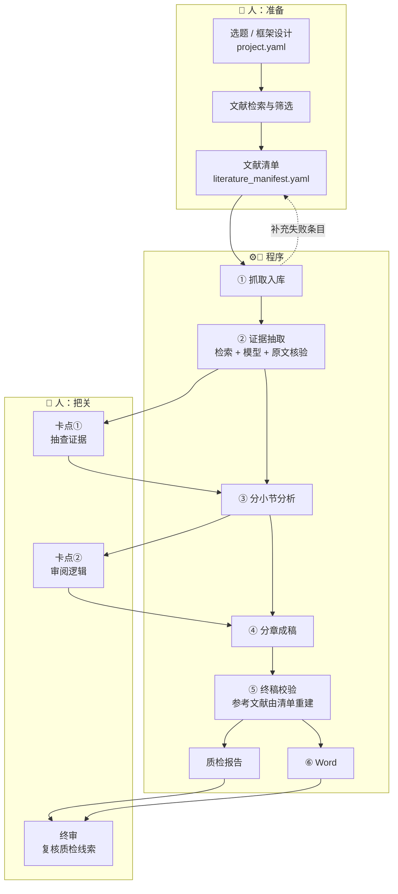

# Scientific_Report_Workflow

**把一份文献清单，加工成一篇关键论断可追溯到原文的技术调研报告（Markdown + Word）。**

这个仓库解决一个具体问题：写专业技术调研报告时，每个论断都必须有出处；而让大模型直接"写一篇报告"，最大的风险恰恰是**编造**——编出不存在的数据，或把 A 文献的结论安到 B 文献头上。

本项目把"写报告"拆成若干阶段，让 AI 在每一步只做一件事，并用**代码**（而不是提示词里的一句"请不要编造"）去核验它的输出。人负责选题、选文献、把关；AI 负责读、归纳、成文；代码负责核对与兜底。

---

## 目录

1. [适合谁、不适合谁](#适合谁不适合谁)
2. [报告撰写的完整流程：谁做什么](#报告撰写的完整流程谁做什么)
3. [实现逻辑](#实现逻辑)
4. [程序逻辑是否完备、能否产出高质量报告](#程序逻辑是否完备能否产出高质量报告)
5. [快速开始](#快速开始)
6. [做你自己的专题](#做你自己的专题)
7. [命令一览](#命令一览)
8. [成本与耗时](#成本与耗时)
9. [局限与声明](#局限与声明)
10. [常见问题](#常见问题)
11. [仓库结构与开发](#仓库结构与开发)

---

## 适合谁、不适合谁

| 你是…… | 你想…… | 建议先读 |
|---|---|---|
| 情报 / 调研 / 战略分析人员 | 围绕一个技术主题，快速得到结构规范、引用可查的初稿 | 第 2、5、6 节 |
| 研究生 / 科研人员 | 做某个方向的技术综述，并清楚每个结论出自哪篇文献 | 第 2、3、4 节 |
| 开发者 | 换模型、换检索方式、加数据源、改输出格式 | 第 3、11 节与 [docs/ARCHITECTURE.md](docs/ARCHITECTURE.md) |

**不适合：** 需要原创实验数据的论文；没有现成文献可依据的纯观点文章；对"零错误"有硬性要求却没有人工复核的场合。本项目产出的是**需要人工把关的高质量初稿**，不是免审成品。

---

## 报告撰写的完整流程：谁做什么

一份有出处的调研报告，从选题到定稿大致经过 13 个环节。下表标明每个环节由谁负责，以及本仓库覆盖哪些。

图例：👤 人　🤖 AI 模型　⚙️ 代码（确定性处理，不调用模型）

| # | 环节 | 谁做 | 做什么 | 产物 | 本仓库 |
|---|---|---|---|---|---|
| 0 | 选题与范围界定 | 👤 | 确定主题、读者、篇幅 | `project.yaml` 的 `project` / `word_count` | 配置模板 |
| 1 | 报告框架设计 | 👤 | 定几章几节；每节"抽什么、不抽什么、怎么分析" | `project.yaml` 的 `chapters` / `report` | 配置模板 |
| 2 | 文献检索与筛选 | 👤 | 找到并挑选可信文献（论文、官方报告、标准） | 候选文献 | **程序之外** |
| 3 | 建立文献清单 | 👤 | 填编号、标题、URL、归属章节 | `literature_manifest.yaml` | 配置模板 + `validate` 校验 |
| 4 | 抓取入库 | ⚙️ | 抓网页 / arXiv 全文 / 读本地文件；失败条目列清单 | `02-原始素材/` | 阶段 1 |
| 5 | 补充缺失正文 | 👤 | 抓取失败的条目手工粘贴正文 | 同上 | 阶段 1 的占位文件 |
| 6 | 证据抽取 | 🤖 + ⚙️ | 分块检索 → 模型摘取事实与原文摘录 → **代码逐条核验** | `03-结构化素材/` | 阶段 2 |
| 7 | **人工卡点①：抽查证据** | 👤 | 核对定义、数字、归属；可直接增删 | 同上 | — |
| 8 | 分小节分析 | 🤖 + ⚙️ | 基于证据推理；代码限制引用范围、核对数字 | `04-分析产出/` | 阶段 3 |
| 9 | **人工卡点②：审阅逻辑** | 👤 | 看论证是否成立、来源是否对得上 | 同上 | — |
| 10 | 分章成稿 | 🤖 + ⚙️ | 一章一章写；标题、引用、篇幅由代码检查，哪章不过重写哪章 | `05-报告草稿/` | 阶段 4 |
| 11 | 终稿校验与输出 | ⚙️ | 参考文献由清单重建；校验结构；输出 Word | `06-终稿与参考文献/` | 阶段 5、6 |
| 12 | 质检 | ⚙️（可选 🤖） | 数字是否出现在所引来源；含数字无引用的句子 | `质检报告.md` | 质检阶段 |
| 13 | **人工终审** | 👤 | 逐条复核质检线索，通读定稿 | 最终报告 | — |

可以看出：**选什么文献（2、3）和最终把关（7、9、13）始终由人负责**，AI 与代码承担的是中间最耗时的"读—摘—写—核"。



---

## 实现逻辑

### 一、核心设计原则

1. **每个阶段只让模型做一件事**：抽取 → 分析 → 成稿。上游产物是下游唯一的事实来源，模型不能"自带知识"。
2. **能用代码验证的，不靠提示词要求**：来源白名单、原文逐字、数字一致、标题结构、引用合法性、参考文献，全部由代码处理。
3. **专题内容属于配置，不属于代码**：写作要点、篇幅预算、风格要求、取材规则都在专题目录里，换专题不改 Python。
4. **每个产物都是人能读、能改的文件**：改了某条证据，下游重跑即可。
5. **失败要显式**：每个阶段返回是否通过，不通过就停下并返回非零退出码，错误不会悄悄流入终稿。

### 二、数据流与文件契约

```
literature_manifest.yaml ──▶ 02-原始素材/<章>/<编号> - 标题.md   （YAML 元数据 + 正文）
                              │
                              ▼  分块 + 检索 + 模型摘取 + 代码核验
                         03-结构化素材/…   每条证据 = 陈述 + 逐字原文摘录 + 分块号
                              │
                              ▼  模型推理（引用只能来自本小节证据）
                         04-分析产出/…     每小节 3–5 条逻辑递进的要点，带来源编号
                              │
                              ▼  分章生成（标题 / 引用 / 篇幅逐章检查）
                         05-报告草稿/chapters/*.md  →  合并稿
                              │
                              ▼  确定性处理（参考文献由清单生成）
                         06-终稿与参考文献/*.md / *.docx / 质检报告.md
```

证据文件是整条链路的"事实底座"，格式是人可读、可手改的 Markdown：

```
## 2.1 概念与检索机理
- 基于图的索引把每个向量作为图中的节点，并保留指向相近向量的边。[DM03]
  > 原文：基于图的索引把每个向量作为图中的节点…… ｜ DM03#c1
```

`DM03#c1` 表示来源 DM03 的第 1 个分块，可以回溯到原文位置。

### 三、各阶段做了什么

**① 抓取入库** 　按 URL 抓取网页正文；arXiv 优先抓全文（HTML 版，失败回退 PDF），不是只抓摘要；`local_file` 可直接读本地文件。已有正文的素材**重跑不覆盖**；失败条目生成占位文件并汇总为"需人工补充"清单。

**② 证据抽取** 　对报告的每个小节：
- 把相关文献全文切块，按"小节名 + 抽取规则 + 关键词"做 BM25 检索，取最相关的若干块（每个来源保底带文首块）；
- 原文多是英文而规则是中文，所以先让模型为该小节生成**双语检索关键词**（也可在配置里手写 `keywords`）；仍然没有命中时，按来源等距抽样覆盖全文，并提示"检索信号弱的小节"；
- 模型只许输出 `{陈述, 逐字原文摘录, 来源, 分块号}`；
- **代码逐条核验，不合格直接丢弃**：来源在白名单内；摘录是所给片段的逐字子串；陈述里的数字出现在原文中；去重。丢弃比例过高则带着具体原因让模型重试一次。

**③ 分小节分析** 　模型基于本小节证据写 3–5 条递进式要点。引用只能来自本小节证据的来源；出现非法引用先带反馈重试，仍有则**删除该要点**；分析里出现证据没有的数字同样重试；某小节没有证据就标记为"无充分证据"并跳过，后面成稿不得就它展开。

**④ 分章成稿** 　每章单独生成，输入是"写作要点 + 本章分析 + 本章证据"。归纳性章节（如"遴选理由"）最后写，能看到其他章已写的内容以避免重复。每章写完立即检查：标题与蓝图逐行一致（模型改了措辞但数量层级对得上时，确定性还原）、引用在允许名单内、字数在预算内、段落不过长。**哪一章不过关，只重写那一章**，并把具体问题告诉模型。摘要、关键词、结论在正文完成后单独生成，只能概括正文已有内容。各章字数预算由总篇幅和各章权重自动推导。

**⑤ 终稿校验** 　不调用模型。参考文献**一律由文献清单生成**（所以不会漏写、写错或凭空多出）；校验标题齐全、无空节、所有引用编号都在清单内、篇幅口径、跨章近重复句；有错误就停下。

**⑥ Word 输出** 　真正的 Title / Heading 样式（导航窗格可用）、正文引用映射为上标 `[n]`、参考文献悬挂缩进且链接可点击、页码，可选目录和单位模板。

**质检（可选扩展：LLM 句级核验、审稿）** 　对终稿再做一次核验：带引用的句子里的数字必须出现在所引来源**全文**中；列出含数字却没有引用的句子；统计各来源被引次数与未被引用的文献。`--llm-check` 额外让模型判断"句子是否被所引原文支持"；`review` 阶段让模型以审稿人身份只提问题、不改文。

### 四、工程机制

| 机制 | 作用 |
|---|---|
| 质量门禁 | 阶段失败即停；`--no-gate` 可强制继续 |
| LLM 缓存 | 相同输入不重复调用，"改一个小节再重跑"只为受影响的部分付费 |
| 并发 | 阶段 2/3/4 默认 3 路并发 |
| 安全写入 | 阶段 2–5 覆盖已有产物前，旧版自动备份到 `.workflow/backup/`，不会冲掉你的手工修改 |
| 运行记录 | 每次运行写出所用模型、各阶段耗时与结果、token 用量 |
| Prompt 外置 | 7 个带版本号的模板，专题目录下可同名覆盖；产物头部记录所用版本 |
| 配置校验 | 运行前检查编号重复、章节不存在、`alias_for` 指向缺失、作者含 `et al.` 等 |

---

## 程序逻辑是否完备、能否产出高质量报告

这一节给出**对这套程序的审计结论**，包括已确认的、已修复的和仍然存在的问题。

### 一句话结论

> **逻辑上是闭环的：从文献清单到终稿，每一步都有输入输出契约和门禁，证据层与引用层有代码级核验。它能稳定产出"结构规范、引用可查"的初稿；是否达到可交付的高质量，取决于文献清单、抽取规则、所用模型，以及你在三个人工环节的把关。目前没有在真实模型上做过端到端实跑，所以 Prompt 的实际效果仍待验证。**

### 已确认成立的保证

| 保证 | 由什么实现 |
|---|---|
| 证据里的每条摘录确实出自该来源原文 | 逐字子串核验（含空白、全半角、连字归一化） |
| 证据里的数字确实出现在原文中 | 数字字面核验 |
| 引用编号不会指向不存在或越权的来源 | 白名单；非法引用被确定性删除 |
| 参考文献只来自你的清单，不会被模型编造 | 由 manifest 生成，模型不参与 |
| 错误不会悄悄流入终稿 | 阶段门禁 + 终稿结构校验 |
| 你的手工修改不会被无声覆盖 | 抓取不覆盖；其余阶段覆盖前备份 |

### 本次审计发现并已修复的问题

| 问题 | 后果 | 修复 |
|---|---|---|
| **跨语言检索失效**：中文检索词在 BM25 里命中不了英文原文 | 检索退化成只取文首几块，等于没解决"截断"问题——**这是对报告质量影响最大的一个** | 小节可配 `keywords`；LLM 生成双语检索词；仍无命中时等距抽样兜底并告警；附回归测试 |
| PDF 行尾连字符断词、连字（fi） | 合法引文被误判为"非原文逐字"而被丢弃，证据变少 | 入库时去连字符；引文比对做 NFKC 归一化 |
| 模型改写标题措辞 | 整章硬失败，流水线卡死 | 数量与层级一致时确定性还原 |
| 重跑覆盖手工修改 | 人工校对成果丢失 | 覆盖前自动备份 |

### 仍然存在的局限（请务必知晓）

1. **"摘录真实"不等于"理解正确"。** 逐字核验保证引文存在，但模型对引文的**转述**可能过度概括或张冠李戴。默认只有数字被核验；语义是否被支持，要靠人工卡点①，或开启 `--llm-check`（模型判断，本身也可能出错）。
2. **跨文献的综合判断只发生在分析阶段**，且基于"每个小节自己的证据"。需要跨小节、跨章节比较的深层论证，质量主要取决于模型和你写的 `analyze_task`。
3. **覆盖面取决于你的文献清单。** 程序不会替你发现遗漏的重要文献，清单里没有的内容，报告里就不会有。
4. **检索是 BM25，不是向量检索。** 术语与原文用词差异很大时仍可能漏检；可通过 `keywords` 或调大 `retrieval.top_k` 缓解。
5. **数字核验是字面比对。** "7 万"与 70,000、"约两倍"这类换算会误报或漏报（宁可多标，不少标）。
6. **事实时效性不检查。** 来源本身过时，报告也会过时。
7. **未做真实模型端到端验证。** 全部 47 项自动化测试都是离线的（使用模拟模型）。真实模型对 Prompt 的遵循程度、抓取成功率、成本，都要在你的环境里实测。

### 建议的首次验收方法

拿一个你熟悉的小专题（6–10 篇文献、2–3 章）跑一遍，并回答这几个问题：

1. **检索是否到位？** 控制台是否出现"检索信号弱的小节"？抽 5 条证据，看原文摘录是否真的支撑陈述。
2. **证据是否够用？** 每个小节保留了几条？被丢弃的比例是否很高（说明模型常违规，或原文换算多）？
3. **成稿是否越界？** 随机抽 10 个带引用的句子，对照来源原文，数一数有几句过度概括。
4. **质检报告说了什么？** 被标出的数字是真错还是单位换算。
5. **耗时与花费？** 对照运行记录里的 token 用量估算正式专题成本。

如果第 3 步的过度概括率偏高，优先收紧该小节的 `extract_rule` 与 `analyze_task`，其次考虑换更强的模型，再其次开启 LLM 句级核验。

---

## 快速开始

```bash
git clone git@github.com:Andreawwwbnu/Scientific_Report_Workflow.git
cd Scientific_Report_Workflow
python -m venv .venv && source .venv/bin/activate
pip install -e .
```

### 第一步：不联网、不要密钥，先看流程长什么样

```bash
report-wf run demo --mock
```

用虚构素材和离线的模拟模型跑完整条流水线，产物在 `projects/demo/output/`。`--mock` 的输出只是机械复述输入，**用来验证流程，不是真实报告**。示例产物见 [`examples/demo_output/`](examples/demo_output/)。

### 第二步：接入真实模型，跑你自己的专题

```bash
cp .env.example .env        # 填入 DEEPSEEK_API_KEY（任何 OpenAI 兼容接口都可以）

report-wf validate low_precision          # 校验配置与清单：不联网、不花钱
report-wf run low_precision --stages 1    # 抓取；按提示手工补充失败条目
report-wf run low_precision --stages 2    # 证据抽取 → 去做人工卡点①
report-wf run low_precision --stages 3    # 分析     → 去做人工卡点②
report-wf run low_precision --stages 4-7  # 成稿、终稿、Word、质检
```

也可以一次跑完：`report-wf run low_precision`。阶段未通过门禁时会停下并返回非零退出码，修复后重跑即可。

---

## 做你自己的专题

```bash
report-wf init my_topic       # 复制模板到 projects/my_topic/
```

只需编辑两个文件（模板里每个字段都有注释）：

**`literature_manifest.yaml`——文献清单。** 每条写编号、标题、URL、归属章和小节。实用字段：`alias_for`（同一篇文献的镜像条目，引用自动归并）、`related_urls`（同一成果的多个入口一起抓）、`local_file`（直接指向本地正文）。

**`project.yaml`——专题配置。**

| 配置块 | 决定什么 |
|---|---|
| `chapters` | 取材结构：有哪些章、哪些小节；每小节写 `extract_rule`（抽什么、不抽什么）、`analyze_task`（怎么分析）、可选 `keywords`（检索关键词） |
| `report.chapters` | 成稿结构：标题、`weight`（篇幅权重）、`write_guide`（本章写作要点）、是否设小节、是否最后写；可把多个取材章压缩成更少的节 |
| `word_count` | 目标篇幅；各章字数由它和权重自动推导 |
| `draft.style_rules` | 专题级写作要求（读者对象、语气、禁用词） |
| `retrieval` | 分块大小、每小节取几块、是否启用查询扩展 |
| `references` | 是否只列被引文献、编号顺序、作者截断规则 |
| `llm` | 各阶段用哪个模型、并发数、是否缓存 |

**写好 `extract_rule` 的要点：** 说清"抽什么"，更要说清"不抽什么"（如"不展开具体索引实现"）；规则里点名的文献编号会自动加入该小节的候选来源；原文是英文时，建议补几个英文术语作为 `keywords`。

想定制提示词：在专题目录下新建 `prompts/extract.md` 等同名文件即可覆盖默认版本。

---

## 命令一览

| 命令 | 作用 |
|---|---|
| `report-wf validate <项目>` | 校验配置与文献清单 |
| `report-wf run <项目> --stages 2-4` | 运行指定阶段（`all` / `1-7` / `fetch,structure,…`） |
| `report-wf run <项目> --only-chapter 02,03` | 只处理指定章（阶段 2/3/4） |
| `report-wf run <项目> --force` | 阶段 1 强制重抓已有素材 |
| `report-wf run <项目> --llm-check` | 质检时启用 LLM 句级核验 |
| `report-wf run <项目> --stages review` | 让模型当审稿人，输出审稿意见 |
| `report-wf status <项目>` | 查看各阶段产物是否齐全 |
| `report-wf init <名称>` | 从模板创建新专题 |

其他选项：`--root`（覆盖输出目录）、`--no-cache`、`--no-gate`、`--mock`。`<项目>` 可以是 `projects/` 下的目录名，也可以是任意目录路径。

---

## 成本与耗时

模型调用次数大致是：

- 阶段 2 ≈ 小节数 × 2（检索词扩展 + 证据抽取）
- 阶段 3 ≈ 小节数
- 阶段 4 ≈ 章数 + 1（摘要/结论）
- LLM 句级核验与审稿默认关闭；核验不通过触发的重试会增加次数

以 `low_precision`（4 章、11 个小节）为例，最少约 50 次调用（含检索词扩展）。相同输入第二次运行直接命中缓存、不重复计费；阶段 2/3/4 默认 3 路并发。

---

## 局限与声明

- **LLM 产出必须人工核验。** 本项目降低编造风险、把需要复核的地方标出来，**不能保证零错误**。详见上文"仍然存在的局限"。
- 网页抓取受反爬和 JS 渲染影响；arXiv 的 PDF 回退需要额外安装 `pypdf`。抓不到的条目请手工补充正文。
- 报告质量的上限取决于文献清单的质量与你对抽取规则的打磨。
- 自动化测试全部离线、使用模拟模型；真实模型的表现需自行实测。

---

## 常见问题

**没有 API Key 能用吗？** 可以体验流程：`--mock` 全程离线；阶段 1 和 `validate` 也不需要密钥。真正生成内容的阶段 2–4 需要模型。

**能用别的模型吗？** 任何 OpenAI 兼容接口都可以（默认 DeepSeek）。在 `project.yaml` 的 `llm` 里改模型名，在 `.env` 里改密钥与地址。

**我手工改了证据或某章草稿，重跑会被覆盖吗？** 重跑阶段 N 会重新生成阶段 N 的产物，但覆盖前旧版会备份到 `output/.workflow/backup/`。想保护某章草稿，用 `--only-chapter` 只重跑别的章。

**文献是英文、报告是中文，可以吗？** 可以。证据里的原文摘录保持原文语言，陈述用中文，数字核验照常工作；检索阶段会生成双语关键词。

**为什么参考文献不让模型写？** 这是最容易出现"看起来合理的编造"的地方。参考文献只来自你的清单，由代码格式化。

**输出可以是别的格式吗？** 终稿本身是 Markdown，可用 Pandoc 等转换；也可仿照 `s6_to_word.py` 增加输出阶段。

---

## 仓库结构与开发

```
├── report_workflow/            核心代码（每个阶段一个模块）
│   ├── s1_fetch.py … s6_to_word.py, s7_qc.py
│   ├── corpus.py               分块 + BM25 检索（含跨语言兜底）
│   ├── evidence.py             证据 / 分析文件格式
│   ├── references.py           参考文献生成
│   ├── llm.py                  OpenAI 兼容客户端、缓存、模拟模型、并发
│   ├── config.py               配置、校验、篇幅预算、安全写入
│   └── prompts/                7 个带版本号的 Prompt 模板
├── projects/
│   ├── _template/              带逐项注释的新专题模板
│   ├── demo/                   离线演示专题（虚构素材）
│   ├── low_precision/          大模型低精度计算
│   └── frontier_risk/          前沿模型风险评估
├── examples/                   示例产物
├── docs/ARCHITECTURE.md        数据契约、检索、质量门禁、扩展点
├── CHANGELOG.md                版本变化与审计修复记录
└── tests/                      47 项离线测试
```

常见扩展点：

| 想做的事 | 改哪里 |
|---|---|
| 换模型 / 服务商 | `project.yaml` 的 `llm.*` |
| 换检索方式（如向量检索） | `corpus.Corpus.search_with_info`，保持返回 `Chunk` 列表 |
| 新增数据源 | `s1_fetch.fetch_one`，或使用 `local_file` |
| 新增输出格式 | 仿照 `s6_to_word.py` 增加阶段，读取终稿 Markdown |
| 新增校验规则 | `s7_qc.py`，或 `s4_draft.check_chapter` / `s5_finalize.validate_final` |

```bash
pip install -e ".[dev]"
ruff check .
pytest -q                       # 全部离线，不需要网络和 API Key
report-wf run demo --mock       # 端到端冒烟
```

## License

MIT，见 [LICENSE](LICENSE)。
